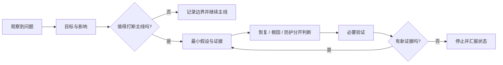

# Harness Error Enlight · 错误启发

简体中文 | [English guide](README.en.md)

[](LICENSE)
[](https://github.com/ywtang199-lang/harness-error-enlight/issues)

让 AI 在处理问题时先判断**要不要现在处理、应该处理到什么程度、验证到哪里可以停止**。

A lightweight, Chinese-first agent skill for risk-aware troubleshooting, first-principles questions, scoped adversarial review, and reusable error learning.

**记录错误不等于必须立即治理；决定延期不等于可以标记已解决。**

## 30 秒了解

它针对三种常见的 AI 协作失控：

| 失控模式 | 这个技能要求代理改变什么 |
| --- | --- |
| 临时办法奏效，就报告“解决” | 分开报告恢复、根因和防护；下次先检查旧经验 |
| 小问题不断升级成工程项目 | 先看用户影响、主线阻塞和 P 级，再决定投入 |
| 一个测试通过后继续无边界回归 | 选择保留真实故障机制的最小充分验证，满足门槛后停止 |



### 立即试用

在支持 `skills` CLI 的环境中：

```sh
npx skills add ywtang199-lang/harness-error-enlight
```

在 Codex 中也可以直接说：

> 使用 `$harness-error-enlight` 分析当前问题，先判断优先级和主线影响，再决定最小处置与验证范围。

安装命令会从 GitHub 获取公开仓库；如果宿主不支持 `skills` CLI，可按[手动安装说明](#安装与更新)放入用户技能目录。安装后重新打开会话或检查技能列表。

> 当前状态：可试用的早期版本。规则已经过文本检查和有限行为演练，但真实效果取决于宿主、模型、项目规则和可用证据；请通过 [Issues](https://github.com/ywtang199-lang/harness-error-enlight/issues) 报告实际失败案例。

### 它适合谁

- 使用 Codex、Claude Code、Cursor 或其他支持 `SKILL.md` 的代理，并希望减少重复排查。
- 维护有项目记忆、错误记录或 Harness 文件矩阵的个人开发者和小型团队。
- 经常遇到“这次好了但下次又来”“为小问题过度工程化”“测试越跑越大”的工作流。

它不适合被当作万能调试器、自动化质量门禁、后台监控器或根因保证器。它不会替你获得授权，也不会自动修改项目规则、删除数据、发布系统或扩大测试范围。

## 为什么做这个技能

AI 很容易把“当前恢复”误报成“问题解决”，把“发现风险”误变成“现在必须重构”，也容易用更多测试换取并不增加的确定感。这个技能把注意力放回目标、证据和实际影响：先决定是否值得打断主线，再决定需要多少排查和验证。

它的价值不在于产生更长的报告，而在于让每个动作都能回答：改变了什么决定、减少了什么风险、什么时候可以停。

## 适用范围

- 问题反复发生，或此前的“解决”依赖缓存、重启、会话、机器等临时状态。
- 排查持续尝试却没有新增证据，需要重新判断假设与投入。
- 小问题开始引出架构重构、平台化建设或不相关改动。
- 需要决定验证到哪一层，或已有充分证据却迟迟不收尾。
- 需要维护项目错误记录，并把可靠经验用于下一次工作。

普通任务不需要额外启动完整审查。它不替代专门的调试工具、项目验收、迁移安全要求或人的授权，也不提供后台监控、自动同步或强制执行门禁。

## 安装与更新

### 在 Codex 中安装

可以向具备技能安装器的 Codex 提出：

> 使用 skill-installer，从 https://github.com/ywtang199-lang/harness-error-enlight 安装这个技能；技能位于仓库根目录。

也可以手动将仓库克隆到用户技能目录。以下示例适用于默认目录；如果配置了 `CODEX_HOME`，将目标改为其下的 `skills/harness-error-enlight`。

Windows PowerShell：

```powershell
git clone https://github.com/ywtang199-lang/harness-error-enlight.git "$env:USERPROFILE\.codex\skills\harness-error-enlight"
```

macOS / Linux：

```sh
git clone https://github.com/ywtang199-lang/harness-error-enlight.git "$HOME/.codex/skills/harness-error-enlight"
```

目标文件夹已存在时先检查已有安装，不要覆盖。安装后在下一轮检查技能列表；若尚未出现，重新打开会话再检查。显式指定 `SKILL.md` 路径也可让代理读取它。

此仓库没有运行时依赖；不要求安装 CodeScene、数据库、MCP 服务或其他参考技能。结构检查工具如有 Python 依赖，属于开发验证工具，并非使用本技能的前提。

### 更新和个人改造

对于 Git 克隆安装，先进入技能目录：

```sh
git status --short
git diff
```

工作区干净且希望跟进上游时使用 `git pull --ff-only`。存在自己的改动时，先提交到个人分支或保留副本，再决定如何合并；不要使用重置覆盖个人规则。通过安装器下载的目录不一定带 Git 元数据，更新前应保留改动并使用原安装方式。

其他支持 `SKILL.md` 的宿主可以读取核心说明，但安装位置、自动发现和独立代理能力需按该宿主配置；当前未完成跨宿主兼容性验证。

### 分发与发现

公开仓库本身是稳定的来源地址；推广时优先让用户能看懂、能安装、能反馈：

1. 在 GitHub 维护清楚的 README、Topics、Issues 和版本 Release。每次规则行为变化都用新版本说明影响了哪个决定。
2. 将仓库提交或等待收录到 [skills.sh](https://skills.sh/) 这类技能目录。目录的安装统计和排序由平台决定；目录页面、安装量或徽章都不替代用户审阅技能内容。
3. 在 Agent Skills、Codex、Claude Code、Cursor 等社区发布一个具体失败案例，展示“原来怎么走偏、现在如何判断、验证在哪里停止”。不要只发布抽象口号。
4. 用 Issue 收集脱敏案例，用 PR 提交最小规则改动；持续维护比一次性宣传更能建立信任。

适合的推广材料是短案例、决策前后对比和可复现的调用句子。避免声称“保证不复发”“自动修复根因”或“所有任务都更安全”；当前仓库没有这些证据。

## 怎么使用

### 分析并修复问题

> 使用 $harness-error-enlight，先判断这个错误是否阻塞当前目标，再在现有授权范围内修复。区分临时恢复与根因修复，完成必要验证后停止。

### 只读检查临时修复

> 使用 $harness-error-enlight，只读分析这个问题为什么再次发生，检查旧处理是否只是临时恢复。先不要修改文件。

### 审查方案是否过度工程化

> 使用 $harness-error-enlight，对当前方案做第一性原理反问和对抗性审查：它解决的是本次目标吗？什么证据支持扩大改动？有没有更小的充分方案？

### 决定测试范围

> 使用 $harness-error-enlight，根据本次改动与故障机制，说明必须验证什么、为什么足够，以及什么新证据才需要扩大验证。保留项目明确要求的交付检查。

### 沉淀已确认经验

> 使用 $harness-error-enlight，将本次已确认根因和关键失败尝试写入项目现有错误记录。同根因复发补充旧记录，不自动修改全局规则。

默认允许宿主自动发现；实际是否触发取决于宿主。希望明确应用时使用上述显式调用。

## 它如何作出决定

### 先决定处理深度

分别判断类别、实际影响与优先级。环境问题可能阻塞交付，架构问题也可能暂时无需处理；P 级不由名称或代码规模决定。

沿用项目自己的 P 级定义。项目没有定义时，技能提供暂定参考：P0 是正在或有证据即将发生的严重难恢复损害；P1 阻塞当前核心目标且无可接受恢复路径；P2 可有限处理或延期；P3 为没有当前实质影响的改进机会。每次分级需有影响证据。

### 第一性原理反问

关键问题包括：真正要交付什么？哪些是事实？什么证据能推翻假设？不处理的代价是什么？更小的方案是否已经足够？下一个检查会改变什么决定？

这些问题用于代理自查，向用户报告影响决策的结论。无需把每个小问题都变成一轮长问卷。

### 对抗性审查

在明确要求审查、问题复发、证据矛盾、高影响操作、扩大范围或改变长期行为规则时，检查最有可能推翻方案的反例，同时检查漏修和过度处理。

默认一轮聚焦审查；修正后仅复核受影响发现。宿主支持并允许委派时，可按技能条件使用一名独立只读审查者；否则明确报告为自查。审查不额外授权真实实验或范围外变更。

### 停止条件

选择最窄且仍保留真实故障机制的验证。缓存问题可能需要刷新，持久化问题可能需要重新加载，共享契约可能需要双端检查。“最小”不等于只跑单测。

必要检查通过后停止。新改动、新失败、影响原证据有效性的环境变化或明确交付门槛，才构成重跑或扩大测试的理由。有限、具有区分信号的间歇性复现实验仍然允许。

## 如何接入项目 Harness

技能沿用现有文件及模板，不要求新建完整矩阵：

| 位置 | 保存什么 |
| --- | --- |
| 本技能 `SKILL.md` | 可复用的判断方法 |
| 项目 `AGENTS.md` | 简短协作约束与技能入口 |
| 项目错误记录，例如 `project_error_enlight.md` | 事件证据、关键尝试、恢复限制、复发与防护 |
| 项目长期记忆，例如 `PROJECT_MEMORY.md` | 用户确认的稳定事实与决策 |
| 项目协作说明，例如 `CONTRIBUTING.md` | 稳定操作方法及验收命令 |

在希望接入的项目中，可以自行加入下面这条入口约定：

> 遇到反复失败、临时修复复发、问题分级或验证范围争议时，使用可用的 harness-error-enlight 技能，并结合本项目错误记录核验历史经验；遵守当前任务授权和项目验收要求。技能不可用时说明限制并按现有项目规则处理。

它是可选的项目约定示例，安装本技能不会自动写入项目文件。项目没有错误库时可以先在汇报中记录；用户要求持久记录后，一个 Markdown 文件即可起步。

## 一份有用的收尾示例

以下是虚构示例，并非本仓库的真实修复结果：

> 当前目标是恢复页面访问，问题暂定 P1。清缓存后页面可以打开，但刷新仍失败，因此只能报告临时恢复，根因尚未确认。已有证据指向 HTML 与资源版本边界；下一步对比两者版本。暂不进行全业务回归，也不引入新的部署框架。相关尝试已在项目错误记录中关联，待证据支持后更新根因。

如果问题确实已修复，应说明根因证据及相关复验结果；如果选择延期，应说明影响和重新处理条件。两者都不要求承诺“永不复发”。

## 仓库结构与改进方式

| 文件 | 用途 |
| --- | --- |
| [SKILL.md](SKILL.md) | 代理读取的核心规则 |
| [审查方法](references/adversarial-review.md) | 按需加载的对抗性审查 |
| [行为案例](references/behavior-cases.md) | 有限的行为验收场景 |
| [来源说明](references/sources.md) | 借鉴内容、取舍与上游声明 |
| [贡献说明](CONTRIBUTING.md) | 如何提交失败案例和有证据的改进 |
| [更新日志](CHANGELOG.md) | 每次公开规则变化的简短记录 |

持续改进从真实失败开始：描述错误决定 → 提出最小规则变化 → 验证目标案例及一个相邻反例 → 保留有效变化。对于只改措辞、没有行为变化的编辑，不启动完整行为评估。

行为验证是决策演练，不等同于真实系统修复测试。格式检查通过也不证明模型会正确执行所有规则。请在 Issue 或 PR 中附上去敏后的失败案例、期望行为和验证边界，避免只增加泛化的“必须”“永远”。

## 许可证与致谢

本项目采用 [MIT License](LICENSE)，允许使用、修改和再分发，须保留适用的版权和许可声明。

选择性借鉴 [Superpowers](https://github.com/obra/superpowers)、[workers.io WIO](https://github.com/workersio/skills)、[self-improving-skills](https://github.com/chemny/self-improving-skills) 和 [smarter-agent](https://github.com/AnimaApp/smarter-agent)。这是独立改造的技能，不是这些项目的官方版本；上游贡献者及保留声明见 [来源说明](references/sources.md)。
